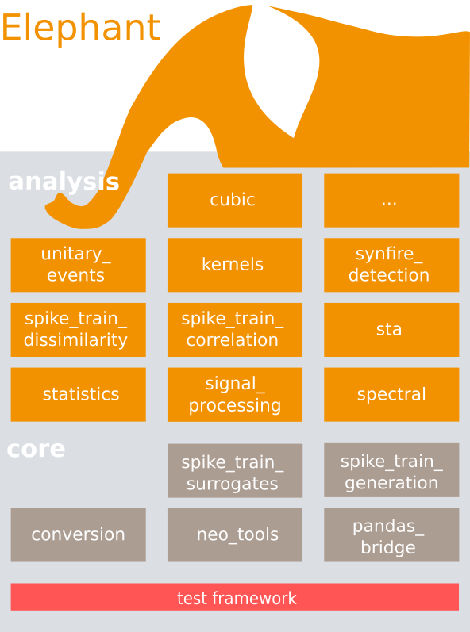

********
Overview
********

What is Elephant?
=====================

As a result of the complexity inherent in modern recording technologies that yield massively parallel data streams and in advanced analysis methods to explore such rich data sets, the need for more reproducible research in the neurosciences can no longer be ignored. Reproducibility rests on building workflows that may allow users to transparently trace their analysis steps from data acquisition to final publication. A key component of such a workflow is a set of defined analysis methods to perform the data processing.

Elephant (Electrophysiology Analysis Toolkit) is an open-source, community centered library for the analysis of electrophysiological data in the Python programming language. The focus of Elephant is on generic analysis functions for spike train data and time series recordings from electrodes, such as the local field potentials (LFP) or intracellular voltages. In addition to providing a common platform for analysis codes from different laboratories, the Elephant project aims to provide a consistent and homogeneous analysis framework that is built on a modular foundation. Elephant is the direct successor to Neurotools [#f1]_ and maintains ties to complementary projects such as OpenElectrophy [#f2]_ and spykeviewer [#f3]_.

* Analysis functions use consistent data formats and conventions as input arguments and outputs. Electrophysiological data will generally be represented by data models defined by the Neo_ [#f4]_ project.
* Library functions are based on a set of core functions for commonly used operations, such as sliding windows, converting data to alternate representations, or the generation of surrogates for hypothesis testing.
* Accepted analysis functions must be equipped with a range of unit tests to ensure a high standard of code quality.

Elephant library structure
==========================

Elephant is a standard python package and is structured into a number of submodules. The following is a sketch of the layout of the Elephant library (0.1.0 release).

    
    Modules of the Elephant library. Modules containing analysis functions are colored in blue shades, core functionality in green shades.
   

Conceptually, modules of the Elephant library can be divided into those related to a specific field of analysis methods, and core functions that provide a layer of various foundation and utility functions. All available modules are available directly on the the top level of the Elephant package in the ``elephant`` subdirectory to avoid unnecessary hierarchical clutter. Unit tests for all functions are located in the ``elephant/test`` subdirectory and are named according the module name. This documentation is located in the top level ``doc`` subdirectory.

In the following we provide a brief overview of the modules available in Elephant.

Analysis modules
----------------

``signal_processing``
^^^^^^^^^^^^^^^^^^^^^
Basic processing procedures for analog signals (e.g., performing a z-score of a signal, or filtering a signal).

``spectral``
^^^^^^^^^^^^
Identification of spectral properties in analog signals (e.g., the power spectrum)

``statistics``
^^^^^^^^^^^^^^
Statistical measures of spike trains (e.g., Fano factor) and functions to estimate firing rates.

``spike_train_correlation``
^^^^^^^^^^^^^^^^^^^^^^^^^^^
Functions to quantify correlations between sets of spike trains.

``sta``
^^^^^^^
Calculate the spike-triggered average of an analog signal and related measures.

Core modules
------------

``conversion``
^^^^^^^^^^^^^^
This module allows to convert standard data representations (e.g., a spike train stored as Neo ``SpikeTrain`` object) into other representations useful to perform calculations on the data. An example is the representation of a spike train as a sequence of 0-1 values (*binned spike train*). 

``spike_train_generation``
^^^^^^^^^^^^^^^^^^^^^^^^^^
This module provides functions to generate spike trains according to prescribed stochastic models (e.g., a Poisson spike train). 

``spike_train_surrogates``
^^^^^^^^^^^^^^^^^^^^^^^^^^
This module provides functionality to generate surrogate spike trains from given spike train data. This is particularly useful in the context of determining the significance of analysis results via Monte-Carlo methods.

``neo_tools``
^^^^^^^^^^^^^
Provides useful convenience functions to work efficiently with Neo objects.

``pandas_bridge``
^^^^^^^^^^^^^^^^^
Bridge from Elephant to the pandas library.

References
==========
.. [#f1]  http://neuralensemble.org/NeuroTools/
.. [#f2]  http://neuralensemble.org/OpenElectrophy/
.. [#f3]  http://spykeutils.readthedocs.org/en/0.4.1/
.. [#f4]  Garcia et al. (2014) Front.~Neuroinform. 8:10
.. _`Neo`: http://neuralensemble.org/neo/
