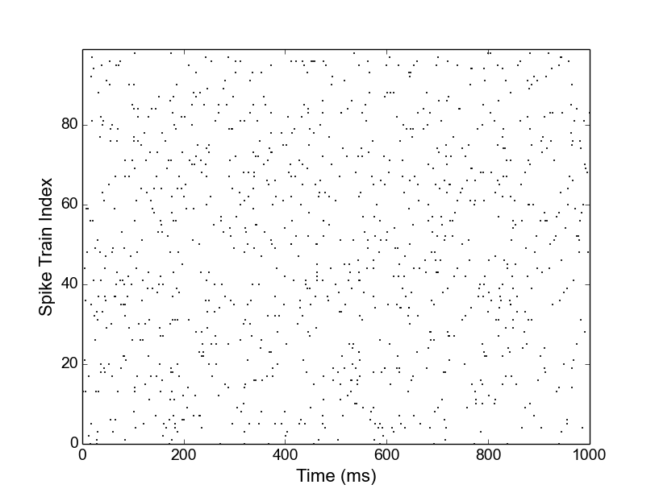
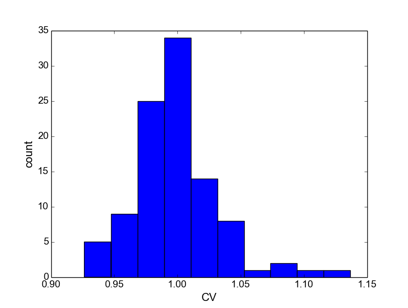

*********
Tutorials
*********

Getting Started
---------------

In this first tutorial, we will go through a very simple example of how to use Elephant. We will numerically verify that the coefficient of variation (CV), a measure of the variability of inter-spike intervals, of a spike train that is modeled as a random (stochastic) Poisson process is 1.

As a first step, install Elephant and its dependencies as outlined in :ref:`install`. Next, start up your Python shell. Under Windows, you can likely launch a Python shell from the Start menu. Under Linux or Mac, you may start Python by typing::

    $ python

As a first step, we want to generate spike train data modeled as a stochastic Poisson process. For this purpose, we can use the :mod:`elephant.spike_train_generation` module, which provides the :func:`homogeneous_poisson_process` function::

    >>> from elephant.spike_train_generation import homogeneous_poisson_process

Use the :func:`help()` function of Python to display the documentation for this function::

    >>> help(homogeneous_poisson_process)

As you can see, the function requires three parameters: the firing rate of the Poisson process, the start time and the stop time. These three parameters are specified as :class:`Quantity` objects: these are essentially arrays or numbers with a unit of measurement attached. We will see how to use these objects in a second. You can quit the help screen by typing ``q``.

Let us now generate 100 independent Poisson spike trains for 100 seconds each with a rate of 10 Hz for which we later will calculate the CV. For simplicity, we will store the spike trains in a list::

    >>> from quantities import Hz, s, ms
    >>> spiketrain_list = [
    ...     homogeneous_poisson_process(rate=10.0*Hz, t_start=0.0*s, t_stop=100.0*s)
    ...     for i in range(100)]

Notice that the units ``s`` and ``Hz`` have both been imported from the :mod:`quantities` library and can be directly attached to the values by multiplication. The output is a list of 100 Neo :class:`SpikeTrain` objects::

    >>> print(len(spiketrain_list))
    100
    >>> print(type(spiketrain_list[0]))
    <class 'neo.core.spiketrain.SpikeTrain'>

Before we continue, let us (optionally) have a look at the spike trains in a spike raster plot. This can be created, e.g., using the `matplotlib`_ framework (you may need to install this library, as it is not one of the dependencies of Elephant)::

    >>> import matplotlib.pyplot as plt
    >>> import numpy as np
    >>> for i, spiketrain in enumerate(spiketrain_list):
            t = spiketrain.rescale(ms)
            plt.plot(t, i * np.ones_like(t), 'k.', markersize=2)
    >>> plt.axis('tight')
    >>> plt.xlim(0, 1000)
    >>> plt.xlabel('Time (ms)', fontsize=16)
    >>> plt.ylabel('Spike Train Index', fontsize=16)
    >>> plt.gca().tick_params(axis='both', which='major', labelsize=14)
    >>> plt.show()

Notice how the spike times of each spike train are extracted from each of the spike trains in the for-loop. The :meth:`rescale` operation of the quantities library is used to transform units to milliseconds. In order to aid the visualization, we restrict the plot to the first 1000 ms (:func:`xlim` function). The :func:`show` command plots the spike raster in a new figure window on the screen.

    
    Spike raster plot of the 100 Poisson spike trains showing the first second of data.

From the plot you can see the random nature of each Poisson spike train. Let us now calculate the distribution of the 100 CVs obtained from inter-spike intervals (ISIs) of these spike trains. Close the graphics window to get back to the Python prompt. The functions to calculate the list of ISIs and the CV are both located in the :mod:`elephant.statistics` module. Thus, for each spike train in our list, we first call the :func:`isi` function which returns an array of all *N-1* ISIs for the *N* spikes in the input spike train (refer to the online help using ``help(isi)``). We then feed the list of ISIs into the :func:`cv` function, which returns a single value for the coefficient of variation::

    >>> from elephant.statistics import isi, cv
    >>> cv_list = [cv(isi(spiketrain)) for spiketrain in spiketrain_list]

In a final step, let's plot a histogram of the obtained CVs (again illustrated using the matplotlib framework for plotting)::

    >>> plt.hist(cv_list)
    >>> plt.xlabel('CV', fontsize=16)
    >>> plt.ylabel('count', fontsize=16)
    >>> plt.gca().tick_params(axis='both', which='major', labelsize=14)
    >>> plt.show()

As predicted by theory, the CV values are clustered around 1. This concludes our first "getting started" tutorial on the use of Elephant. More tutorials will be added soon.

    
    Distribution of CV values of the ISIs of 100 Poisson spike trains.

.. _`matplotlib`: http://matplotlib.org/